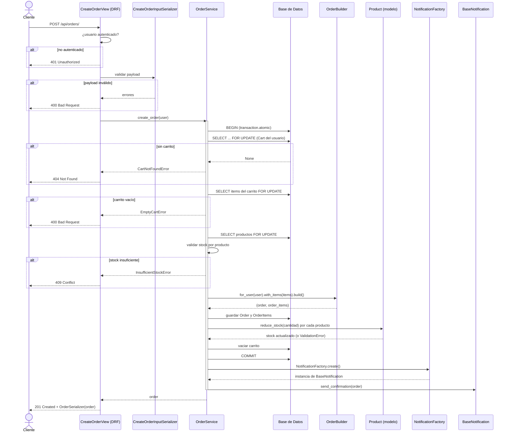

# Diagrama de Secuencia — Creación de Pedido

La funcionalidad más compleja implementada en esta entrega es la **creación
de un pedido a partir del carrito de compras** (`POST /api/orders/`), porque
involucra validaciones de negocio, concurrencia (bloqueo de filas), dos
patrones creacionales (Builder y Factory) y una transacción atómica.

## Puntos clave que ilustra el diagrama

- **Service Layer como orquestador único:** `OrderService` es el único punto
  que coordina modelo, builder, factory y transacción; la `View` no conoce
  ninguna de estas reglas.
- **Builder** encapsula el ensamblaje de la entidad compleja `Order` (con sus
  `OrderItem` derivados de los ítems del carrito), separando "cómo se
  construye" de "cuándo se construye".
- **Factory** desacopla `OrderService` de la implementación concreta de
  notificación (consola en desarrollo, correo en producción), cumpliendo el
  principio de inversión de dependencias.
- **Manejo de errores por capas:** las excepciones de negocio
  (`CartNotFoundError`, `EmptyCartError`, `InsufficientStockError`) se
  originan en el Service/Domain y se traducen a códigos HTTP únicamente en
  la View.
