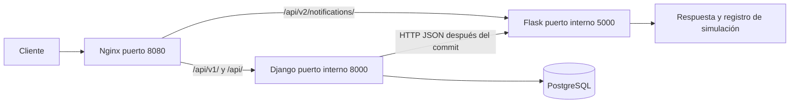

# Migración a Microservicios (Strangler Pattern)

## Alcance y estado inicial

Módulo seleccionado: **notificaciones de confirmación de pedidos**. Base analizada: commit `616e6e1` de Volt. El proyecto es un avance: `ConsoleNotification` y `EmailNotification` imprimían mensajes; no había SMTP, cola ni mediciones de carga. La extracción conserva esa simulación y devuelve JSON explícitamente con `status: simulated`. No implica envío real de correo.

## Matriz de decisión

Escala cualitativa: baja, media y alta. Frecuencia y recursos futuros son estimaciones de diseño, no resultados de un benchmark. En acoplamiento, un nivel bajo favorece la extracción.

| Módulo | Frecuencia de cambio prevista | Recursos actuales / futuros | Acoplamiento | Decisión |
| --- | --- | --- | --- | --- |
| Catálogo | Media: filtros y atributos | Bajo / medio por búsquedas | Alto: productos relacionados con carrito, pedidos y stock | Mantener en Django |
| Pedidos e inventario | Media: reglas de compra | Medio / alto por transacciones y bloqueos | Alto: requiere consistencia entre pedido, stock y carrito | Mantener en Django |
| Notificaciones | Alta: canales, proveedores y plantillas | Bajo / latencia de red al incorporar proveedores | Bajo: basta un mensaje con identificador y usuario | Extraer a Flask |

Notificaciones es un efecto secundario crítico para informar al comprador, pero no debe determinar si la compra queda registrada. Solo necesita datos escalares y puede evolucionar sin modificar los modelos del comercio. No se elige por consumo CPU actual: se elige por límites claros, bajo acoplamiento y futura dependencia de proveedores externos. Extraer pedidos primero implicaría distribuir una transacción que hoy necesita permanecer atómica.

## Separación técnica

- Django conserva usuarios, catálogo, carrito, direcciones, pedidos e inventario y es el único servicio que accede a PostgreSQL.
- Flask contiene la lógica de formato y selección del canal de notificación. No importa Django, no usa su ORM ni consulta sus tablas. No requiere una base propia porque la simulación no persiste estado.
- `RemoteNotification` adapta un pedido al contrato JSON. La fábrica selecciona el adaptador con `NOTIFICATIONS_BACKEND=remote`. El modo `local` conserva la implementación anterior para ejecución local o reversión.
- `transaction.on_commit` retrasa la llamada hasta confirmar la transacción exterior. Un rollback no emite la notificación.
- La llamada HTTP tiene un límite de 2 segundos. Un error de conexión, timeout, HTTP o JSON se registra sin convertir un pedido confirmado en una respuesta de compra fallida.

## Arquitectura



Nginx conserva el URI en `proxy_pass`. `/api/v1/` se añade como alias en Django; `/api/` sigue funcionando. El tráfico público hacia la ruta extraída llega a Flask. La llamada interna desde Django usa el nombre DNS `notifications`, sin pasar por Nginx. Solo Nginx publica un puerto del host. `/static/` sirve los archivos recolectados por Django.

## Contrato REST

`POST /api/v2/notifications/`, cabeceras `Content-Type: application/json` y `X-API-Key: <clave del servicio>`.

```json
{"order_id": 123, "username": "ana", "channel": "console"}
```

`order_id`: entero positivo, no booleano. `username`: texto no vacío, máximo 150 caracteres. `channel`: `console` o `email`; por defecto `console`.

Respuesta 200:

```json
{"order_id":123,"channel":"console","status":"simulated","message":"Pedido #123 confirmado para ana"}
```

Errores JSON: 400 para JSON o campos inválidos; 401 para clave inválida; 503 si falta configuración del servicio; 500 ante un error interno, sin exponer detalles de la excepción. Los errores HTTP también tienen un objeto `error`. El servicio limita el cuerpo a 16 KiB. `GET /health/` permite comprobar disponibilidad sin credenciales. La clave es una credencial entre servicios, no debe ponerse en un frontend ni reemplaza la autenticación de compradores. El endpoint de simulación no comprueba la existencia del pedido en Django.

## Ejecución con Docker

Requiere Docker Engine y Compose v2.

```bash
cp .env.example .env
# Editar .env con claves propias.
docker compose up --build -d
docker compose ps
docker compose exec django python manage.py createsuperuser
```

Visitar `http://localhost:8080/admin/`. PostgreSQL arranca primero y Django ejecuta migraciones y recolecta estáticos. Nginx espera a que Django y Flask estén saludables. Los volúmenes conservan la base y los estáticos. SQLite sigue disponible sin `POSTGRES_HOST`; los datos SQLite anteriores NO se copian automáticamente a PostgreSQL.

Comprobar la bifurcación:

```bash
curl -i http://localhost:8080/api/v1/categories/
curl -i http://localhost:8080/api/categories/
# Sustituir CLAVE por NOTIFICATIONS_API_KEY de .env.
curl -i http://localhost:8080/api/v2/notifications/ \
  -H 'Content-Type: application/json' -H 'X-API-Key: CLAVE' \
  -d '{"order_id":123,"username":"ana","channel":"console"}'
curl -i http://localhost:8080/api/v2/notifications/ \
  -H 'Content-Type: application/json' -H 'X-API-Key: CLAVE' -d '{}'
docker compose logs notifications
```

Resultados esperados: 200 en catálogo, 200 con `simulated` en la simulación válida y 400 en el cuerpo vacío. Crear un producto y usuario/carrito mediante los mecanismos actuales, y hacer `POST /api/v1/orders/` autenticado, permite comprobar la llamada automática. Detener `notifications` y crear otro pedido permite verificar que el pedido se mantiene y Django registra el fallo.

## Pruebas y límites

```bash
python -m pip install -r requirements.txt -r notifications_service/requirements.txt
python manage.py test Volt
python -m unittest discover -s notifications_service -v
```

Las pruebas cubren ambos canales, validación, autenticación, errores 500 estructurados, selección del adaptador, contrato HTTP, indisponibilidad, ejecución tras commit, rollback y compatibilidad de rutas. Las pruebas de Django usan SQLite; no sustituyen una ejecución con PostgreSQL y Nginx.

La integración es síncrona: separar el proceso no elimina la espera HTTP del pedido. La entrega es de mejor esfuerzo, sin persistencia, reintentos ni deduplicación. Un fallo puede perder una notificación, y una solicitud repetida vuelve a simularla. Como siguiente evolución se recomienda outbox transaccional y un trabajador con reintentos e idempotencia antes de enviar correos reales. Esta configuración está orientada a la demostración local; no configura TLS.

## Migración gradual y reversión

1. Mantener el resto del monolito y desplegar Flask.
2. Enrutar `/api/v2/notifications/` a Flask y conservar rutas anteriores.
3. Activar `NOTIFICATIONS_BACKEND=remote` en Django (Compose ya lo configura).
4. Verificar contratos, creación de pedidos y comportamiento ante fallos.
5. Para revertir el productor, cambiar la variable a `local` y recrear Django. El gateway v2 sigue disponible hasta retirarlo explícitamente.

## Wiki y Git Flow

Este archivo está listo para publicarse como página **Migración a Microservicios (Strangler Pattern)** en la pestaña Wiki de GitHub. Guardar Markdown bajo `wiki/` en el repositorio principal no publica automáticamente la Wiki, que usa un repositorio independiente.

Sugerencia de commits reales por responsabilidad:

- `feat(notifications): extract Flask notification service`
- `feat(orders): integrate notifications after transaction commit`
- `feat(infra): route Django and Flask through Nginx and Compose`
- `docs(architecture): document notification strangler migration`

El equipo debe revisar, probar y registrar sus contribuciones reales. Esta entrega local no fabrica autores, commits colaborativos ni evidencia de push. La bonificación temporal depende de la entrega efectiva durante la sesión indicada por el docente.
